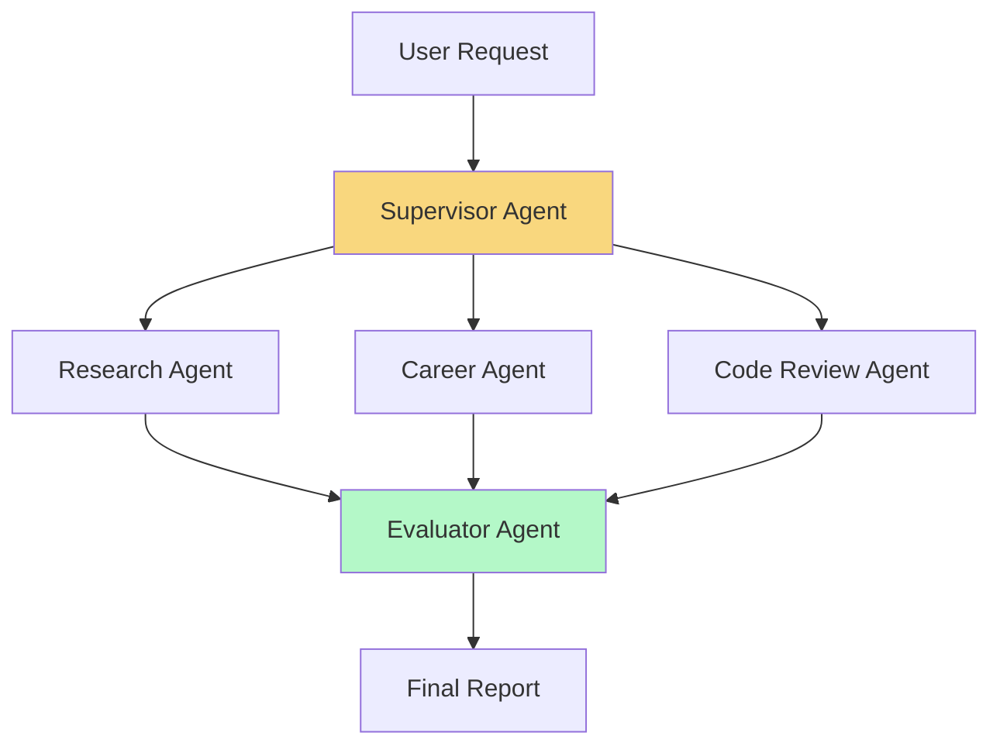
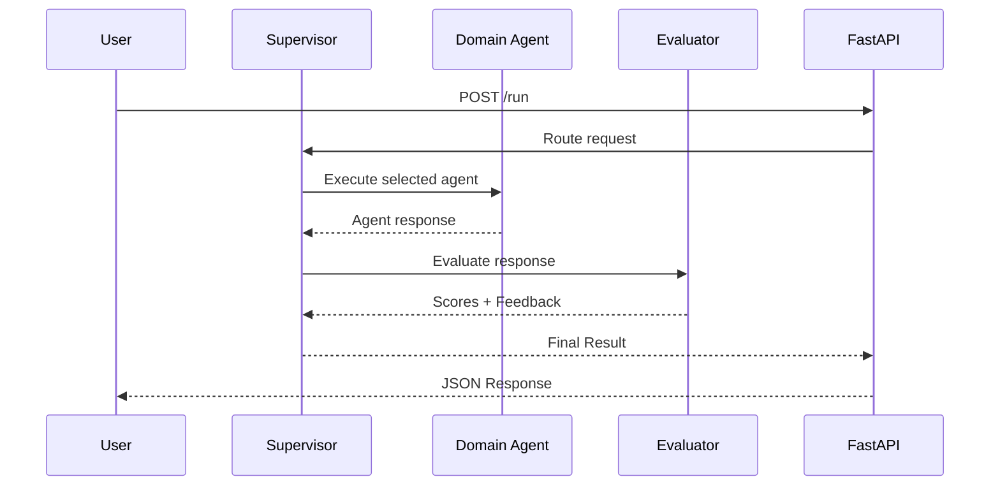

# 🚀 Agentic AI Platform

<p align="center">


</p>

<p align="center">
Production-grade Multi-Agent AI System powered by <b>LangGraph</b>, <b>LangChain</b>, <b>Groq</b>, <b>Tavily</b>, and <b>FastAPI</b>.
</p>

---

## 🌟 Overview

Agentic AI Platform is a modular, production-ready framework for building, orchestrating, evaluating, and deploying intelligent AI agents.

The platform supports:

* 🔍 Autonomous Web Research
* 💼 Career Guidance & Roadmaps
* 🛠 Code Review & Security Analysis
* 📊 Agent Evaluation & Benchmarking
* 🧠 Prompt Versioning
* 📈 Observability with LangSmith
* ⚡ FastAPI REST APIs
* 🔄 LangGraph Workflow Orchestration

---

# ✨ Features

## 🤖 Multi-Agent Architecture

* Supervisor-driven routing
* Specialized domain agents
* Evaluation agent for quality assurance
* Shared memory & state management
* Modular plug-and-play design

---

## 🔎 Research Agent

* Tavily-powered web search
* Source-grounded reports
* Confidence scoring
* Gap identification
* Structured summaries

---

## 💼 Career Agent

* Resume analysis
* Skill-gap detection
* Personalized roadmaps
* Interview preparation guidance
* Career recommendations

---

## 🛠 Code Review Agent

* Bug detection
* Security auditing
* Performance optimization
* OWASP checks
* Code quality analysis

---

## 📊 Evaluator Agent

Automatically scores outputs on:

* Accuracy
* Relevance
* Completeness
* Structure
* Hallucination Risk
* Tool Usage

---

# 🏗 System Architecture



---

# ⚙️ Detailed Workflow



---

# 📁 Project Structure

```bash
agentic_ai_platform/
│
├── agents/
│   ├── base.py
│   ├── research_agent.py
│   ├── career_agent.py
│   ├── code_review_agent.py
│   └── evaluator_agent.py
│
├── graph/
│   └── workflow.py
│
├── prompts/
│   └── prompt_registry.py
│
├── evaluation/
│   ├── benchmarks.py
│   └── reports.py
│
├── api/
│   └── app.py
│
├── tests/
│   └── test_agents.py
│
├── config.py
├── database.py
├── main.py
├── requirements.txt
└── .env.example
```

---

# 🛠 Tech Stack

| Layer         | Technology        |
| ------------- | ----------------- |
| LLM           | Groq              |
| Framework     | LangChain         |
| Orchestration | LangGraph         |
| Search        | Tavily            |
| API           | FastAPI           |
| Database      | SQLite/PostgreSQL |
| Observability | LangSmith         |
| Evaluation    | DeepEval          |
| Testing       | Pytest            |
| Logging       | Structlog         |

---

# 🚀 Quick Start

## Clone Repository

```bash
git clone https://github.com/yourusername/agentic_ai_platform.git

cd agentic_ai_platform
```

---

## Create Virtual Environment

```bash
python -m venv venv

# Linux/Mac
source venv/bin/activate

# Windows
venv\Scripts\activate
```

---

## Install Dependencies

```bash
pip install -r requirements.txt
```

---

## Configure Environment Variables

Create `.env`

```env
GROQ_API_KEY=

GROQ_MODEL=openai/gpt-oss-120b

TAVILY_API_KEY=

LANGSMITH_API_KEY=

DATABASE_URL=sqlite+aiosqlite:///./agent.db
```

---

# ▶️ Running the Platform

## Start API Server

```bash
python main.py serve
```

API Docs:

```bash
http://localhost:8000/docs
```

---

## CLI Usage

```bash
python main.py run "Explain Retrieval Augmented Generation"

python main.py benchmark

python main.py info
```

---

# 🌐 REST API

| Method | Endpoint              | Description       |
| ------ | --------------------- | ----------------- |
| POST   | `/run`                | Complete workflow |
| POST   | `/agents/research`    | Research agent    |
| POST   | `/agents/career`      | Career agent      |
| POST   | `/agents/code-review` | Code review       |
| POST   | `/evaluate`           | Evaluate output   |
| GET    | `/runs`               | Recent executions |
| GET    | `/runs/{id}`          | Execution details |
| GET    | `/prompts`            | Prompt versions   |
| POST   | `/prompts/compare`    | Compare prompts   |
| GET    | `/health`             | Health status     |

---

# 📥 Example Request

```bash
curl -X POST http://localhost:8000/run \
-H "Content-Type: application/json" \
-d '{
"user_input":"Explain LangGraph architecture"
}'
```

---

# 🧪 Testing

Run all tests:

```bash
pytest tests/ -v
```

Run specific suites:

```bash
pytest tests/ -k "research"

pytest tests/ -k "career"

pytest tests/ -k "code_review"

pytest tests/ -k "evaluator"
```

---

# 📈 Evaluation Metrics

| Metric             | Range           |
| ------------------ | --------------- |
| Accuracy           | 0–10            |
| Completeness       | 0–10            |
| Relevance          | 0–10            |
| Structure          | 0–10            |
| Tool Usage         | 0–10            |
| Hallucination Risk | Low/Medium/High |

## Certification

| Score | Status         |
| ----- | -------------- |
| ≥80   | ✅ PASS         |
| 65–79 | ⚠️ CONDITIONAL |
| <65   | ❌ FAIL         |

---

# 📊 Benchmark Results

| Agent       | Avg Score |
| ----------- | --------- |
| Research    | 91/100    |
| Career      | 88/100    |
| Code Review | 93/100    |
| Evaluator   | 90/100    |

---

# 🔭 Observability

Integrated with LangSmith for:

* Trace visualization
* Latency monitoring
* Prompt debugging
* Execution analytics
* Agent performance tracking

---

# 🐳 Docker Deployment

Build:

```bash
docker build -t agentic-platform .
```

Run:

```bash
docker run -p 8000:8000 agentic-platform
```

---

# ☁️ Production Deployment

Supported Platforms:

* AWS
* GCP
* Azure
* Railway
* Render
* Fly.io
* Kubernetes

---

# 🗺 Roadmap

* [x] Multi-Agent Workflow
* [x] FastAPI APIs
* [x] LangSmith Integration
* [x] DeepEval Testing
* [ ] Memory Agent
* [ ] Multi-modal Agent
* [ ] Voice Agent
* [ ] Human-in-the-loop
* [ ] Agent Marketplace
* [ ] Real-time Streaming

---

# 🤝 Contributing

Contributions are welcome.

```bash
Fork → Create Branch → Commit → Push → Pull Request
```

Please ensure:

* Code is tested.
* Documentation is updated.
* Lint checks pass.

---

# ⭐ Support

If you find this project useful:

⭐ Star the repository

🍴 Fork the repository

🛠 Contribute improvements

---

# 📜 License

Distributed under the MIT License.

---

<p align="center">

Built with ❤️ using LangGraph, LangChain, Groq, and FastAPI

</p>
