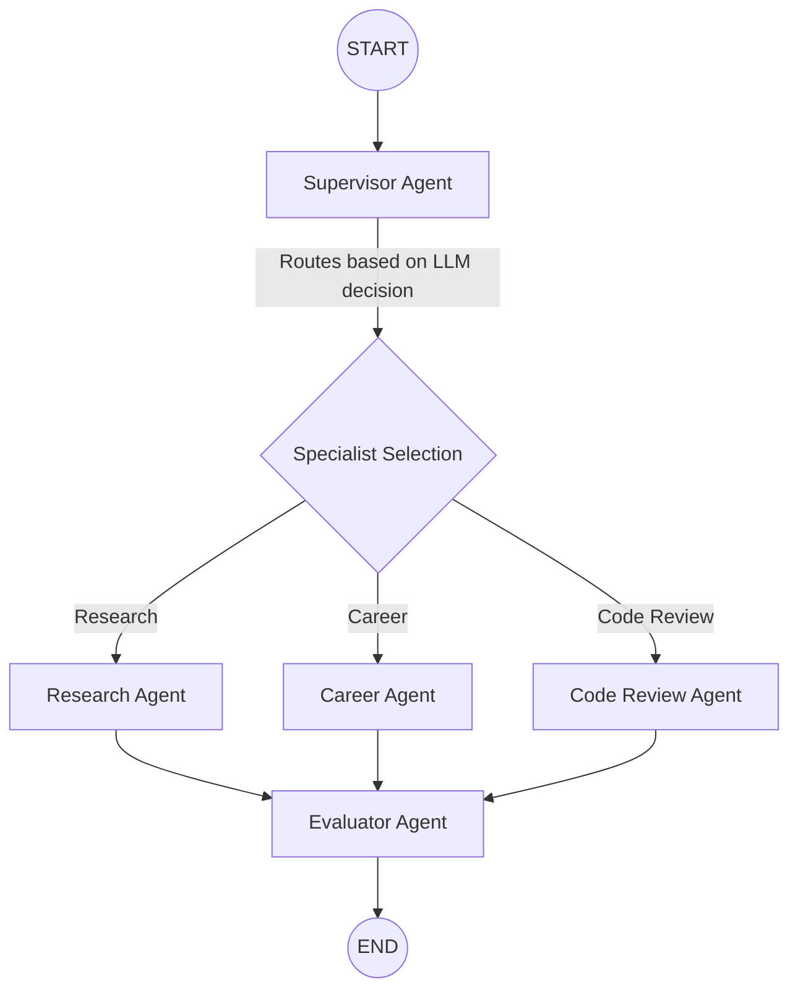

# Agentic AI Platform — Workflow Architecture

This document explains the complete execution flow of the Agentic AI Platform, orchestrated using LangGraph.

## 1. High-Level Architecture
The platform operates as a directed acyclic graph (DAG) where the state flows through a series of nodes (agents). The graph starts with a user request, routes it through a supervisor, processes it via a specialist agent, and finally evaluates the output before returning the result.

## 2. Graph State
The `GraphState` is a typed dictionary that holds the context as it flows through each node in the graph:
- **`user_input`**: The original query from the user.
- **`selected_agent`**: The name of the specialist agent selected by the supervisor.
- **`task_summary`**: A reformulated, clear task description for the specialist agent.
- **`agent_params`**: Any optional parameters/overrides.
- **`agent_output`**: The raw output generated by the specialist agent.
- **`evaluation`**: The quality evaluation metrics produced by the evaluator.
- **`final_report`**: The combined response presented to the user.
- **`error`**: Captured error strings (if any).

## 3. Step-by-Step Execution Flow

### Step 1: Supervisor Node
- **Entry Point**: The workflow receives the user's input.
- **Action**: A lightweight LLM (Groq) with a temperature of 0.0 analyzes the input to decide the best path forward.
- **Output**: It outputs a structured JSON response specifying the `selected_agent` (either `research_agent`, `career_agent`, or `code_review_agent`) and a clean `task_summary` stripped of noise. If routing fails, it defaults to the `research_agent`.

### Step 2: Specialist Execution
Based on the Supervisor's decision, the state transitions to one of the following specialist agents:

#### Path A: Research Agent
- Connects to Tavily Search to gather live information.
- Supports depth controls and result limiting.
- Excellent for queries requiring up-to-date knowledge or web scraping.

#### Path B: Career Agent
- Tailored for reviewing resumes, creating roadmaps, and providing targeted career guidance based on experience levels and industry focus.

#### Path C: Code Review Agent
- Evaluates submitted code for bugs, security vulnerabilities, and performance optimizations.
- Supports strictness adjustments and specific language targeting.

### Step 3: Evaluator Node
- **Input**: The result (`agent_output`) from the chosen specialist agent.
- **Action**: An independent Evaluator Agent inspects the output against an internal rubric.
- **Metrics Evaluated**:
  - Accuracy (0-10)
  - Completeness (0-10)
  - Relevance (0-10)
  - Structure (0-10)
  - Tool Usage Quality (0-10)
  - Hallucination Risk (Low/Med/High)
- **Certification**: Generates an overall score (0-100).
  - ✅ PASS (≥ 80)
  - ⚠️ CONDITIONAL PASS (65-79)
  - ❌ FAIL (< 65)

### Step 4: Final Assembly
The Evaluator node builds a comprehensive markdown response (`final_report`) that includes:
1. The specialist agent's original response.
2. A transparent breakdown of the quality evaluation scores.
3. Metadata such as the agent used, prompt version, and processing latency.

This `final_report` is what is returned to the user via the API/CLI.
